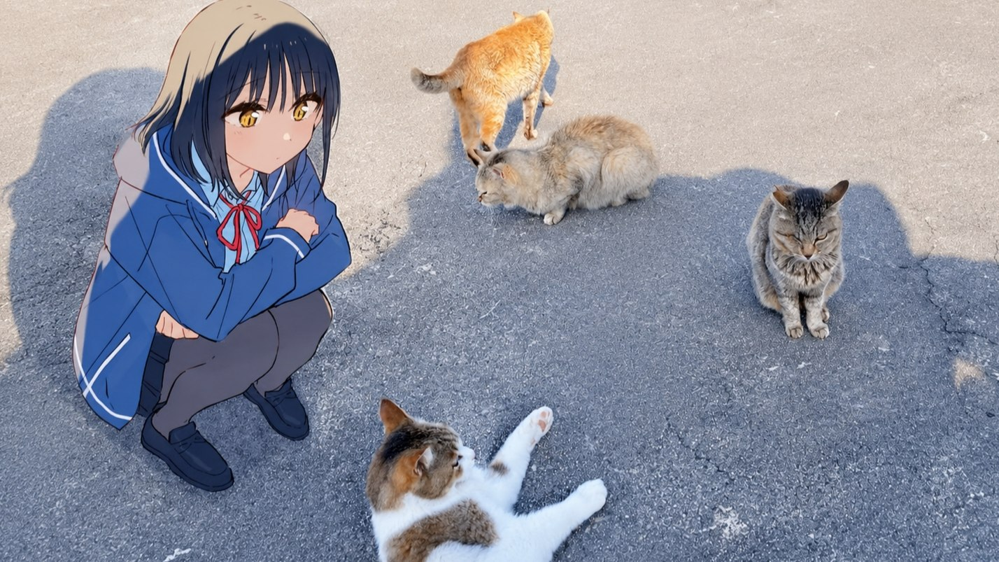

<h1 align="center">Hey, I'm Valeria 👋</h1>

  

<h3 align="center">Backend / Systems developer · Rust</h3>

  Moving from frontend and mobile development (React Native, Kotlin) into <b>backend and systems
  programming</b>, mostly in Rust. Over the past year I've been focusing more on the parts of software
  that sit behind the interface — <b>backend services, data processing, system architecture, and
  performance-sensitive code</b>.

  I enjoy projects where I <b>design the architecture myself</b> — splitting a system into modules,
  defining how they talk to each other, and figuring out the right data flow. I'm especially
  interested in systems where the implementation isn't just about making something work, but
  about understanding the <b>underlying algorithms, performance, and trade-offs</b>.

    I'm still exploring the systems/backend space while also developing my skills in <b>ML and AI
    engineering</b>. I'm particularly interested in the intersection of these areas — building systems
    that combine reliable backend infrastructure with data processing, statistical models, and
    machine learning.

 

<h3 align="center">programming languages</h3>

 

<h3 align="center">contacts</h3>

    Good luck to everyone &lt;3

